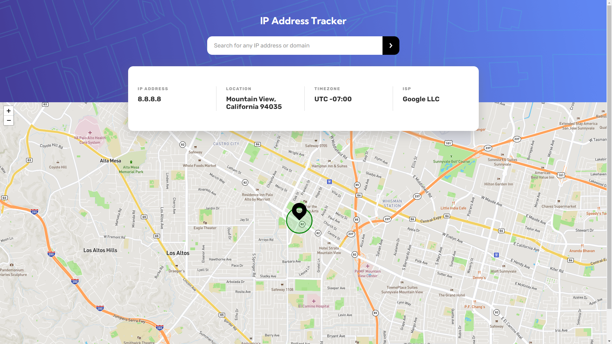

# Frontend Mentor - IP address tracker solution

This is a solution to the [IP address tracker challenge on Frontend Mentor](https://www.frontendmentor.io/challenges/ip-address-tracker-I8-0yYAH0). 

**Important Note:** 

**The IP Geolocation API key and Mapbox access token have NOT been included in the code for security reasons. Please refer to the `/screenshots` folder to see what the final result would look like when searching for an IP address. If you want to use this code, then you'll have to supply your own API key and access token.**

## Table of contents

- [Overview](#overview)
  - [The challenge](#the-challenge)
  - [Screenshot](#screenshot)
  - [Links](#links)
- [My process](#my-process)
  - [Built with](#built-with)
  - [What I learned](#what-i-learned)
  - [Continued development](#continued-development)
  - [Useful resources](#useful-resources)

## Overview

### The challenge

Your task is to build out the project to the designs inside the `/design` folder. You will find both a mobile and a desktop version of the design. 

The designs are in JPG static format. Using JPGs will mean that you'll need to use your best judgment for styles such as `font-size`, `padding` and `margin`. 

Users should be able to:

- View the optimal layout for each page depending on their device's screen size
- See hover states for all interactive elements on the page
- See their own IP address on the map on the initial page load
- Search for any IP addresses or domains and see the key information and location

**A message from FrontEnd Mentor**

---

⚠️ **IMPORTANT** ⚠️: To use the IP Geolocation API by IPify, you'll need to sign up for a free account. You won't need to add any cards details to do this and it's a very quick process. This will generate an API Key for you. Usually, you would be able to restrict your API Key to a specific URL (your own domain). This makes sure that other people can't use your API Key on their own websites. IPify doesn't have this feature, but because you aren't adding your card details, this isn't an issue. **So be sure to only sign up for the free account and DO NOT enter any card details**.

For the mapping API, we recommend using [LeafletJS](https://leafletjs.com/). It's free to use and doesn't require an API Key. If you decide to use another API, like Google Maps or Mapbox, be sure to secure your API Key. Here are guides for both Google Maps and Mapbox, be sure to read through them thoroughly:

- [API Key best practices from Google Developers](https://developers.google.com/maps/api-key-best-practices)
- [How to use Mapbox securely](https://docs.mapbox.com/help/troubleshooting/how-to-use-mapbox-securely/)

Exposing your API Key publicly can lead to other people using it to make requests for their own application if the proper precautions aren't in place. Please be sure you read the guides thoroughly and follow their recommendations.

**We don't take any responsibility if you expose your API Key while completing the challenge and have not secured it.**

---

### Screenshot

I've included 4 screenshots in the `/screenshots` folder: mobile, tablet, desktop, and fullscreen.

### Links

- [Solution URL](https://www.frontendmentor.io/solutions/mobilefirst-solution-using-leafletjs-mapbox-and-flexbox-pFkGe9i5J)
- [Live Site URL](https://victor-nyagudi.github.io/ip-address-tracker/)

## My process

### Built with

- Semantic HTML5 markup
- SCSS
- Flexbox
- Mobile-first workflow
- [Leaflet.js](https://leafletjs.com/) - JS library
- [Mapbox](https://www.mapbox.com/) - Maps provider

### What I learned

This project taught me a lot about using APIs, access tokens, and API keys. The weather app project I did a while back really came in handy
here because whenever I felt stuck, I'd refer to how I did things back then. 

Moving on, I learned a lot about Leaflet.js and how to use it. It was a bit daunting at first, but I took some time to read and understand 
the docs and, thankfully, it all came together in the end.

I also learned a lot about mapbox and how maps work when it comes to things like vector tiles, raster tiles. This knowledge is very beneficial
because now I know how to work with maps should I ever want to start a project that requires the use of locations. 

Another thing I'm really glad I learned about is the geolocator API. All of this together makes for one really cool project to demo to others
and show your experience with programming, especially on the front end. 

Speaking of which, I learned that API keys and access tokens should NOT be stored in the browser or the client side, but on the server. In addition, they should NOT be included in the GitHub repository, whether private or otherwise. 

It's for this reason I've decided not to include them in my repo. I doubt things will work without them when I create a GitHub page for 
this challenge, but this is how I'll do things until I find a better way. I plan on asking for some feedback on how others managed to get 
theirs to work on GitHub pages or wherever they're hosting their sites without exposing sensitive information.

I'll be sure to update this README and project once I get some helpful feedback, God-willing. 

Finally, I learned about the `SameSite` attribute used on cookies to determine whether they are sent in first-party or third-party
context. First-party here means request coming from the same site e.g.`www.webdev.com` and `static.webdev.com`. These two count as the same site,
so the attribute will be `SameSite=Strict`.

Third-party means requesting from third-party sites e.g. `your-project.github.io` and `my-project.github.io` count as different sites, so this
is a cross-site request. The attribute here will be `SameSite=Lax` to allow the cookies to be sent. If the attribute isn't set, it defaults to `SameSite=Lax`.

`SameSite=None` can also be used which means the cookie will be sent in all contexts. However, `Secure` must also be specified meaning 
the cookie requires a secure context i.e. HTTPS instead of HTTP.

### Continued development

Out of the 3 to 4 days I gave myself to finish this challenge, I used 3, so that's a plus. The first two days were mostly for reading up on 
Leaflet.js and Mapbox and practicing with them a little before getting down to the challenge. All in all, timing was good, and I hope to keep
getting better from here on out.

This is the first time I've worked with APIs in a while, so I hope to get some more practice on that front. Even though I still understood
what I did in the previous project, I'd like to be able to work with APIs with minimal to no help from past projects.

It's not a must, but I'd definitely like to work with Leafltet.js and Mapbox in future to get some more experience with them. I think they're 
really cool and could lead to some interesting applications. 

I touched on some object-oriented programming in JS here which was good, but I'd like to do some more with it. 

Finally, I'd like to learn more about securing API keys and access tokens. I garnered quite a bit from this challenge, but I still feel like
I haven't found a concrete way to handle this sensitive information. Looking forward to practicing with that soon, God-willing.

### Useful resources

- [Leaflet.js Documentation](https://leafletjs.com/reference-1.7.1.html#icon) - This helped me get started with showing the map on the page, adding markers, popups, customizing icons, and finding latitudes and longitudes on the map. I really liked it and will use it going forward.
- [IP Geolocation Documentation](https://geo.ipify.org/docs) - This helped me finally understand what endpoint to fetch data from, the JSON
data I'd be getting back, optional query parameters, and code samples. I'd recommend it to anyone still learning how to use the API.
- [Positioning Custom Icon on Map](https://stackoverflow.com/questions/21341274/leaflet-js-api-icons-why-do-iconanchor-and-popupanchor-have-different-coordinat) - A helpful answer on StackOverflow that showed me how to make sure the tip of the custom icon was positioned at the exact co-ordinates of the IP address searched. To do so, you'll first need to know the height and width of the image since the exact co-ordinates are positioned at the top left corner of the image. You can then offset this by setting the x value to half the width and the y value to the images height. 
- [Google Article on Using API Keys](https://cloud.google.com/docs/authentication/api-keys) - An article discussing how to secure API keys.
- [How to Use Mapbox Securely](https://docs.mapbox.com/help/troubleshooting/how-to-use-mapbox-securely/#access-tokens)
- [Difference Between Raster Tiles and Vector Tiles](https://bachasoftware.com/what-is-tile-and-differentiate-between-raster-tile-and-vector-tile/)
